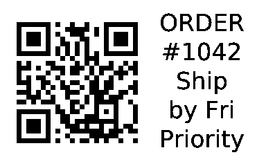
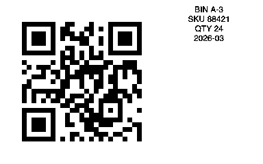
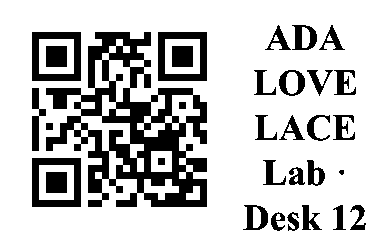
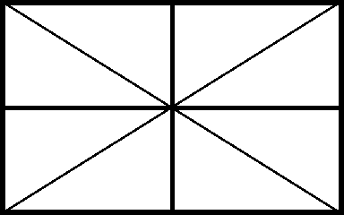

# thermark

Local, scriptable stickers for pocket thermal printers over **Bluetooth LE** or **USB**. No vendor app, no cloud, no account.

Hardware-tested on a real **B1-class** 50×30 mm printer (**384×240 px** at 8 px/mm).
thermark is intentionally **monochrome only**: one black thermal layer on white
media. Multi-colour heads, colour separation, and compressed colour protocols
are out of scope.

---

## The problem

You own a pocket thermal sticker printer, but the official path is a **closed vendor app**. That makes simple physical labels harder than they should be:

- A **guest Wi‑Fi sticker** with the **network name visible** and a **QR people scan to join** becomes a multi-tap GUI flow (often behind an account or template).
- A **“scan this URL”** label for a package, sample, or laptop is the same friction.
- Doing it from a **terminal, script, or small program**, **offline**, with **exact label size**, is basically unsupported.

Printing isn’t impossible — the pain is **control**:

> **Turn a pocket thermal printer into a local tool for stickers that live on real objects — especially “scan to join” and “scan to open” — without cloud or vendor software.**

---

## What thermark is for

| People need | Friction today | With thermark |
|-------------|----------------|---------------|
| **Guest Wi‑Fi** — SSID clear, password in QR | Vendor app / typing passwords aloud | `thermark wifi --ssid "…" --password "…"` |
| **Share a URL** on a package or sample | App templates or phone screenshots | `thermark qr --url "https://…"` |
| **Label bins / cables / samples** | Clunky GUI templates | `thermark qr` with dense side text |
| **Plain text, no QR** | Opening a design app | `thermark text --text "FRAGILE"` |
| **Automate / script** | No real CLI | CLI + Rust library, offline |

**One line:** Make pocket thermal printers useful for everyday **physical QR stickers** (starting with guest Wi‑Fi and links) without vendor apps or the cloud.

Also works for name badges, line-art stickers, calibration, and batch jobs — same offline stack.

| Model | Task | Status |
|-------|------|--------|
| **B1** | `b1` | **Tested** |
| B1 Pro / B21 Pro / D11_H | `d110mv4` | Experimental (`--allow-experimental`) |
| D11 | `d11v1` | Experimental; firmware variants exist |
| D110 | `d110` | Experimental |
| B18 | unresolved | 96 px geometry known; packet capture needed |

The profile registry and job lifecycles are cross-checked against
[NiimBlueLib's model data](https://niim-docs.pages.dev/documents/NIIMBOT_model_characteristics.html),
[packet generators](https://github.com/MultiMote/niimbluelib/blob/main/src/packets/packet_generator.ts),
and the [community print-task captures](https://printers.niim.blue/interfacing/print-tasks/).
Identity detection follows the independently exercised
[niimbot-web-bluetooth flow](https://github.com/iscarelli/niimbot-web-bluetooth).
B2 Pro is deliberately not registered: its
[current capture](https://github.com/MultiMote/niimbluelib/issues/22) uses a
separate two-colour `0xA7`/LZO raster pipeline that thermark does not implement.

## Install / build

```bash
cargo build --release          # → target/release/thermark
cargo test
cargo test --lib --no-default-features
```

| Feature | Default | Enables |
|---------|---------|---------|
| `ble` | yes | Bluetooth LE |
| `serial` | yes | USB serial |

## Setup (once)

Quit any official label app (one BLE client at a time).

```bash
./target/release/thermark scan --save          # full device name → config
./target/release/thermark identify             # model id → DPI, width, task
./target/release/thermark identify --json \
  > local/printer-identity.json                 # shareable hardware capture
./target/release/thermark doctor --use-config  # lid / paper / battery
```

For this project, B1 is the primary product path: it is the only model verified
on owned hardware. Other monochrome profiles stay explicitly experimental until
someone runs the same fixtures on the physical printer.

Config: macOS `~/Library/Application Support/thermark/config.json` · Linux `~/.config/thermark/config.json`  
Address priority: **`-a`** → **`THERMARK_ADDR`** → **config**. Match is **exact** name/id; **`--fuzzy`** only if you mean it.

---

## Sticker recipes

Always pass **`--label 50x30`** (or your media) so the canvas matches the physical sticker. After `scan --save`, omit `-a`.

### Guest Wi‑Fi (primary recipe)

QR = one-tap join. Side text = **network name** (password stays in the QR unless you pass `--show-password`).

**Demo only** (fake credentials, safe to commit):

```bash
./target/release/thermark wifi \
  --ssid "Demo-Guest" \
  --password "demo-not-real" \
  --font-name helvetica \
  --label 50x30 \
  --save fixtures/sticker_wifi.png \
  --no-print
```


**Your real network** (save under `local/`, never `fixtures/` or git):

```bash
mkdir -p local/prints
./target/release/thermark wifi \
  --ssid "YourNetworkName" \
  --password 'your-password' \
  --label 50x30 \
  --save local/prints/home-wifi.png
# or print immediately without saving
```

### Link / package sticker

Scan on a phone → open the URL. Text is what humans read without scanning.

```bash
./target/release/thermark qr \
  --url "https://example.com/o/1042" \
  --text $'ORDER #1042\nShip by Fri\nPriority' \
  --font-name helvetica \
  --label 50x30
```



### Inventory / bin tag

Dense type for SKU, qty, date — still leaves a quiet margin so the printer edge doesn’t smear text.

```bash
./target/release/thermark qr \
  --url "https://example.com/bin/A3" \
  --text $'BIN A-3\nSKU 88421\nQTY 24\n2026-03' \
  --font-name helvetica \
  --font-size 12 \
  --label 50x30
```



### Name / desk badge

```bash
./target/release/thermark qr \
  --url "https://example.com/u/ada" \
  --text $'ADA LOVELACE\nLab · Desk 12' \
  --font-name times \
  --label 50x30
```



### Calibrate print area

Full-bleed pattern to verify margins and feed before a batch.

```bash
./target/release/thermark calibrate --label 50x30
```



### Your own image (art, badge, photo)

Save one-offs under **`local/`** (gitignored) — not `fixtures/`.

```bash
mkdir -p local/prints
# line art: pure B/W, 384×240, then:
./target/release/thermark print -i local/prints/my-art.png \
  --label 50x30 --no-fill --margin 0 -d 4

# photos: center + dither
./target/release/thermark print -i local/prints/photo.jpg \
  --label 50x30 --no-fill --margin 16 --dither -d 3
```

| Flag | Effect |
|------|--------|
| `--no-fill` | Whole image, centered (no crop) |
| `--margin N` | White inset (px) — avoids edge bleed |
| `--dither` | Floyd–Steinberg (photos; skip for line art) |
| `-d 3`…`4` | Density (line art often wants 4) |

Preview QR without printing: `qr ... --save /tmp/out.png --no-print`.

```bash
./target/release/thermark fonts
./target/release/thermark tasks
```

---

## Geometry

| | |
|--|--|
| Resolution | model profile: **203 or 300 dpi** |
| Max width | model profile: **96–591 px** for registered models |
| 50×30 mm sticker | **384×240 px** |

Any size works — pass `--label WxH` in mm. Common rolls:

| `--label` | Pixels | Largest QR | Page bytes (worst case) |
|--|--|--|--|
| `40x20` | 320×160 | 136 px | 8.3 KB |
| `40x30` | 320×240 | 195 px | 12.4 KB |
| `50x30` | 384×240 | 216 px | 14.3 KB |
| `50x80` | 384×640 | 237 px | 38.1 KB |

Width and millimetre conversion come from the detected model profile. On B1,
50 mm media is clamped to its 384 px head; 300 dpi models use their own DPI and
usable width. Height is bounded only by the protocol's `u16` row count.

## Doctor

```bash
./target/release/thermark doctor                 # host + scan
./target/release/thermark doctor --use-config    # + connect / sensors
```

| Exit | Meaning |
|------|---------|
| **0** | Pass or warnings |
| **1** | FAIL — fix before printing |

## Library

```rust
use thermark::{BleTransport, Model, PrinterClient};
use std::time::Duration;

#[tokio::main]
async fn main() -> anyhow::Result<()> {
    let ble = BleTransport::connect("B1-YourPrinter", Duration::from_secs(5)).await?;
    let mut p = PrinterClient::new(ble, Model::B1);
    println!("{}", p.fetch_summary().await?);
    Ok(())
}
```

## Fixtures

[`fixtures/`](fixtures/) holds **public product demos only** (locked by `cargo test --test fixtures_readme`).

Personal prints and real Wi‑Fi labels go in **`local/`** (see [`local/README.md`](local/README.md); gitignored except that note).

| File | Use |
|------|-----|
| `sticker_wifi.png` | Guest Wi‑Fi demo (fake credentials only) |
| `sticker_link.png` | Package / share URL |
| `sticker_inventory.png` | Bin / SKU tag |
| `sticker_name.png` | Name badge |
| `sticker_calibrate.png` | Geometry / bleed check |

## Logging

```bash
./target/release/thermark -v info
RUST_LOG=thermark=debug ./target/release/thermark scan
```

## FAQ

### Part of my label is blank — is the printable area smaller than the label?

Partly, but check the battery first. A dense or dark label draws far more
current than a sparse one, and on a low battery the printer stops part-way
through, which looks exactly like a clipped label. The tell is **inconsistency**:
if the same image prints differently twice, it is power, not geometry.

```sh
thermark info          # battery: 1/4 (low — ...) means charge it
```

Beyond that, side-to-side white border can be physical:

- **Across:** the printhead is 48 mm on a 50 mm label, so ~2 mm is unreachable.
  If it is lopsided rather than even, the roll is off-centre — nudge the guide.
- **Feed:** a charged B1 reaches the full canvas. The default 1 mm top/bottom
  inset is registration insurance because label positioning varies slightly.

### How do I find my printer's real printable area?

```sh
thermark calibrate --boundary
```

Prints one numbered bar per millimetre, each at its own horizontal position.
Read the highest number whose bar printed completely. If repeated charged runs
agree that you need a content inset, save it:

```sh
thermark config safe-area --last-tick 26 --label 50x30
```

Do this on a **charged** printer, or you will measure the battery instead of the
media. If two runs disagree, take the lower number.

The probe adapts to the media: it always marks the last 13 mm, so the final bar
is the last millimetre of *your* label. Pass the size you actually loaded —
`thermark calibrate --boundary --label 40x20`. A safe area measured on one roll
does not transfer to another, so save it per label size.

### Does the printer know what size paper is loaded?

**No — not in millimetres.** You always have to tell it with `--label`.

It does know a surprising amount else, from the RFID tag in the roll core
(`thermark info` prints it): the barcode/SKU, a serial number, how many labels
the roll started with and how many are used, the consumable *type* (gapped,
black-mark, continuous, transparent), and whether the tag read succeeded at all.

What is not on the tag is the physical geometry. Vendor software maps the
barcode to a size through its own catalogue; the printer never reports width or
height, and no field in the protocol carries them. The gap sensor does measure
label pitch mechanically while feeding, but that measurement is used internally
for registration and is never sent back to the host.

So: `--label 40x30` is not thermark being lazy. Nothing on the wire can supply
it.

### I switched to a different roll — 40×20, 40×30, 50×80…

Just change `--label`; everything derives from it. Two things to know:

- **Width is clamped to the detected profile.** On B1 that is 384 px; narrow
  D11/D110/B18 profiles are 96 px, while supported 300 dpi profiles have their
  own measured limits.
- **Narrow media runs out of room for a QR beside text.** The limit is width,
  not height: 40×20 and even 25×15 lay out fine, but 12 mm D110 tape leaves less
  than the 64 px of QR that survives thermal printing, so `qr` errors out rather
  than print something unscannable. Use `text` there, or author it sideways as
  `--label 40x12`.

Re-run `calibrate --boundary` after switching, and save the result with
`--label` so each roll keeps its own safe area.

### How do I check what will print, without wasting a label?

```sh
thermark print -i art.png --label 50x30 --preview out.png
```

Writes exactly the bitmap that would be sent, and prints nothing. `qr`, `text`,
and `wifi` take `--no-print --save out.png` for the same purpose.

### My artwork prints smaller than the label

Artwork usually carries its own white border, and that margin used to be added
to the label's own inset. `thermark print` trims uniform background by default;
`--no-trim` keeps it when the border is deliberate.

### My QR will not scan

Long content needs more modules, and each module gets fewer pixels. Below 2 px
per module thermark refuses outright, because heat bleed closes the gaps and the
code is unreadable even though it looks fine. Shorten the URL, use a shorter
Wi-Fi password, or move to a larger label.

### Nothing connects / "no BLE device matching"

Only one application may hold the printer at a time — quit the vendor app.
Matching is **exact** by default, so use the full advertising name from
`thermark scan` (on macOS the id is a UUID, not a MAC). `--fuzzy` enables
substring matching, which can pick the wrong device.

### Can thermark tell whether the printer is charging?

No. The protocol reports a 0–4 battery level and no charging flag. Check the
device's own indicator, then re-run `thermark info` and confirm the level is
climbing. On a B1 a blinking red light means charging; solid red is a paper
error.

### Why is my text smaller than I expected?

Auto-fit picks the largest size at which every word stays whole. A single long
word that will not fit the column forces a smaller size for the whole block —
pass `--font-size` to override, or shorten the word.

### Does this work without the vendor app or an internet connection?

Yes. Everything runs locally over BLE or USB serial. Nothing is uploaded, and no
account is needed.

## Protocol

See [`AGENTS.md`](AGENTS.md).

## License

MIT
