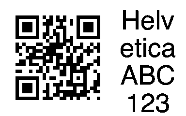
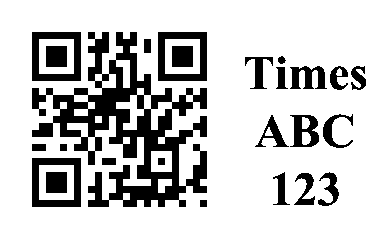
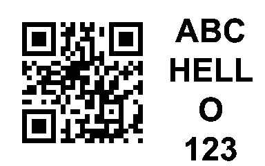
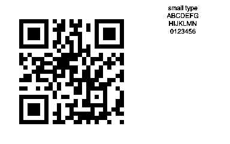
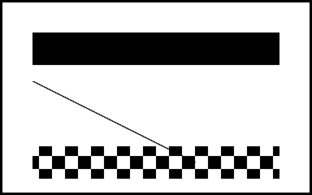

# thermark

Local thermal label printing over **Bluetooth LE** or **USB serial** — no vendor app.

Print **QR + text**, calibration patterns, and rasters at real millimetres (**8 px/mm**). Built and hardware-tested for **B1-class** printers (50×30 mm → **384×240 px**).

| Model | Task | Status |
|-------|------|--------|
| **B1** | `b1` | **Tested** |
| B21 / B18 | `b21v1` | Experimental — needs `--allow-experimental` |
| D11 / D110 | `d110` | Experimental — needs `--allow-experimental` |
| other | `simple` | Experimental — needs `--allow-experimental` |

## Build

```bash
cargo build --release   # → target/release/thermark
cargo test
```

| Feature | Default | Enables |
|---------|---------|---------|
| `ble` | yes | Bluetooth LE |
| `serial` | yes | USB serial |

```bash
cargo test --lib --no-default-features   # protocol + mock only
```

## Setup (once)

Quit any official label app (one BLE client at a time).

```bash
./target/release/thermark scan
./target/release/thermark scan --save          # full advertising name → config.json
./target/release/thermark doctor --use-config  # lid / paper / battery
./target/release/thermark info
```

Config: macOS `~/Library/Application Support/thermark/config.json` · Linux `~/.config/thermark/config.json`  
Address: **`-a`** → **`THERMARK_ADDR`** → **config**. BLE match is **exact** name/id; use **`--fuzzy`** only if you mean it.

## What you print

Always pass **`--label 50x30`** (or your media size) so the canvas matches the label. After `scan --save`, omit `-a`.

### Calibration — find the true print area

```bash
./target/release/thermark calibrate --label 50x30
```


*Border + diagonals + cross on a 384×240 canvas (density default 4).*

### QR + side text (Helvetica)

```bash
./target/release/thermark qr \
  --url "https://example.com" \
  --text $'Helvetica\nABC\n123' \
  --font-name helvetica \
  --label 50x30
```



### QR + Times

```bash
./target/release/thermark qr \
  --url "https://example.com" \
  --text $'Times\nABC\n123' \
  --font-name times \
  --label 50x30
```



### QR + Arial

```bash
./target/release/thermark qr \
  --url "https://example.com" \
  --text $'ABC\nHELLO\n123' \
  --font-name arial \
  --label 50x30
```



### Small type (fixed `--font-size`)

```bash
./target/release/thermark qr \
  --url "https://example.com" \
  --text $'small type\nABCDEFG\nHIJKLMN\n0123456' \
  --font-name helvetica \
  --font-size 11 \
  --label 50x30
```



### Print a raster image

```bash
./target/release/thermark print -i fixtures/test_label.png --label 50x30
```



*Density default 3. Preview without printing: add `--save out.png --no-print` to `qr`.*

### Fonts & tasks

```bash
./target/release/thermark fonts
./target/release/thermark tasks
```

## Geometry

| | |
|--|--|
| Resolution | ~**8 px/mm** (203 dpi) |
| Max width (B1) | **384 px** (~48 mm) |
| 50×30 mm label | **384×240 px** |

## Config & doctor

```bash
./target/release/thermark config set -a "B1-YourPrinter" -m b1
./target/release/thermark config show
./target/release/thermark doctor                 # host + scan
./target/release/thermark doctor --use-config    # + connect / sensors
```

| Exit | Meaning |
|------|---------|
| **0** | Pass or warnings |
| **1** | At least one **FAIL** |

## Library

```rust
use thermark::{BleTransport, Model, PrinterClient};
use std::time::Duration;

#[tokio::main]
async fn main() -> anyhow::Result<()> {
    let ble = BleTransport::connect("B1-YourPrinter", Duration::from_secs(5)).await?;
    let mut p = PrinterClient::new(ble, Model::B1);
    println!("{}", p.fetch_summary().await?);
    Ok(())
}
```

Exact name match by default; substring: `BleTransport::connect_with(..., BleMatchMode::Fuzzy)`.

## Fixtures

PNG previews in [`fixtures/`](fixtures/) are the same images the README shows. They are checked by `tests/fixtures_readme.rs` (dimensions, ink, encode).

```bash
cargo test --test fixtures_readme
```

## Logging

```bash
./target/release/thermark -v info
RUST_LOG=thermark=debug,btleplug=info ./target/release/thermark scan
```

## Protocol

See [`AGENTS.md`](AGENTS.md). Community: the protocol notes in src/protocol.rs.

## License

MIT
