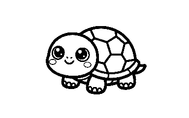
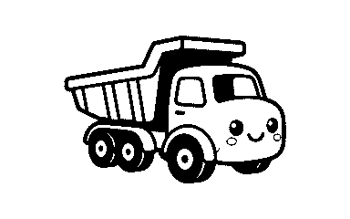

# thermark

Local, scriptable stickers for pocket thermal printers over **Bluetooth LE** or **USB**. No vendor app, no cloud, no account.

Hardware-tested on a real **B1-class** 50×30 mm printer (**384×240 px** at 8 px/mm).

---

## The problem

You own a pocket thermal sticker printer, but the official path is a **closed vendor app**. That makes simple physical labels harder than they should be:

- A **guest Wi‑Fi sticker** with the **network name visible** and a **QR people scan to join** becomes a multi-tap GUI flow (often behind an account or template).
- A **“scan this URL”** label for a package, sample, or laptop is the same friction.
- Doing it from a **terminal, script, or small program**, **offline**, with **exact label size**, is basically unsupported.

Printing isn’t impossible — the pain is **control**:

> **Turn a pocket thermal printer into a local tool for stickers that live on real objects — especially “scan to join” and “scan to open” — without cloud or vendor software.**

---

## What thermark is for

| People need | Friction today | With thermark |
|-------------|----------------|---------------|
| **Guest Wi‑Fi** — SSID clear, password in QR | Vendor app / typing passwords aloud | `thermark wifi --ssid "…" --password "…"` |
| **Share a URL** on a package or sample | App templates or phone screenshots | `thermark qr --url "https://…"` |
| **Label bins / cables / samples** | Clunky GUI templates | `thermark qr` with dense side text |
| **Automate / script** | No real CLI | CLI + Rust library, offline |

**One line:** Make pocket thermal printers useful for everyday **physical QR stickers** (starting with guest Wi‑Fi and links) without vendor apps or the cloud.

Also works for name badges, line-art stickers, calibration, and batch jobs — same offline stack.

| Model | Task | Status |
|-------|------|--------|
| **B1** | `b1` | **Tested** |
| B21 / B18 | `b21v1` | Experimental (`--allow-experimental`) |
| D11 / D110 | `d110` | Experimental |
| other | `simple` | Experimental |

## Install / build

```bash
cargo build --release          # → target/release/thermark
cargo test
cargo test --lib --no-default-features
```

| Feature | Default | Enables |
|---------|---------|---------|
| `ble` | yes | Bluetooth LE |
| `serial` | yes | USB serial |

## Setup (once)

Quit any official label app (one BLE client at a time).

```bash
./target/release/thermark scan --save          # full device name → config
./target/release/thermark doctor --use-config  # lid / paper / battery
```

Config: macOS `~/Library/Application Support/thermark/config.json` · Linux `~/.config/thermark/config.json`  
Address priority: **`-a`** → **`THERMARK_ADDR`** → **config**. Match is **exact** name/id; **`--fuzzy`** only if you mean it.

---

## Sticker recipes

Always pass **`--label 50x30`** (or your media) so the canvas matches the physical sticker. After `scan --save`, omit `-a`.

### Guest Wi‑Fi (primary recipe)

QR = one-tap join. Side text = **network name** (password stays in the QR unless you pass `--show-password`).

**Demo only** (fake credentials, safe to commit):

```bash
./target/release/thermark wifi \
  --ssid "Demo-Guest" \
  --password "demo-not-real" \
  --font-name helvetica \
  --label 50x30 \
  --save fixtures/sticker_wifi.png \
  --no-print
```


**Your real network** (do **not** commit the PNG or put it under `fixtures/`):

```bash
./target/release/thermark wifi \
  --ssid "YourNetworkName" \
  --password 'your-password' \
  --label 50x30
# or: --save /tmp/my-wifi.png --no-print   # keep outside the repo
```

### Link / package sticker

Scan on a phone → open the URL. Text is what humans read without scanning.

```bash
./target/release/thermark qr \
  --url "https://example.com/o/1042" \
  --text $'ORDER #1042\nShip by Fri\nPriority' \
  --font-name helvetica \
  --label 50x30
```


### Inventory / bin tag

Dense type for SKU, qty, date — still leaves a quiet margin so the printer edge doesn’t smear text.

```bash
./target/release/thermark qr \
  --url "https://example.com/bin/A3" \
  --text $'BIN A-3\nSKU 88421\nQTY 24\n2026-03' \
  --font-name helvetica \
  --font-size 12 \
  --label 50x30
```


### Name / desk badge

```bash
./target/release/thermark qr \
  --url "https://example.com/u/ada" \
  --text $'ADA LOVELACE\nLab · Desk 12' \
  --font-name times \
  --label 50x30
```


### Calibrate print area

Full-bleed pattern to verify margins and feed before a batch.

```bash
./target/release/thermark calibrate --label 50x30
```


### Line-art sticker (turtle)

Bold B/W line art is the best look on thermal (hard edges, no dither). Margin is baked into `sticker_turtle.png` (384×240):

```bash
./target/release/thermark print \
  -i fixtures/sticker_turtle.png \
  --label 50x30 \
  --no-fill --margin 0 -d 4
```



Same pipeline for other line art (e.g. excavator): preprocess to 384×240 B/W with baked margin, then print with `--no-fill --margin 0 -d 4`.

```bash
./target/release/thermark print \
  -i fixtures/sticker_excavator.png \
  --label 50x30 \
  --no-fill --margin 0 -d 4
```


```bash
./target/release/thermark print \
  -i fixtures/sticker_dumptruck.png \
  --label 50x30 \
  --no-fill --margin 0 -d 4
```



### Art + text badge (crew / site)

Hybrid layout: line art on the left, bold readable type on the right. Precomposed 384×240 pure B/W (`sticker_crew.png`) so the printer gets hard edges — no dither, no fill crop.

```bash
./target/release/thermark print \
  -i fixtures/sticker_crew.png \
  --label 50x30 \
  --no-fill --margin 0 -d 4
```


Compose your own the same way: place art in ~left 55%, text column on the right, hard-threshold to 0/255, save at label size, then print with `--no-fill --margin 0 -d 4`.

### Your own photo or PNG

Thermal is **1-bit**. For photos, center + dither so midtones don’t blotch:

```bash
./target/release/thermark print -i your-photo.jpg \
  --label 50x30 --no-fill --margin 16 --dither -d 3
```

| Flag | Effect |
|------|--------|
| `--no-fill` | Whole image, centered (no crop) |
| `--margin N` | White inset (px) — avoids edge bleed |
| `--dither` | Floyd–Steinberg (photos; skip for line art) |
| `-d 3`…`4` | Density (line art often wants 4) |

Preview QR without printing: `qr ... --save /tmp/out.png --no-print`.

```bash
./target/release/thermark fonts
./target/release/thermark tasks
```

---

## Geometry

| | |
|--|--|
| Resolution | ~**8 px/mm** (203 dpi) |
| Max width (B1) | **384 px** (~48 mm) |
| 50×30 mm sticker | **384×240 px** |

## Doctor

```bash
./target/release/thermark doctor                 # host + scan
./target/release/thermark doctor --use-config    # + connect / sensors
```

| Exit | Meaning |
|------|---------|
| **0** | Pass or warnings |
| **1** | FAIL — fix before printing |

## Library

```rust
use thermark::{BleTransport, Model, PrinterClient};
use std::time::Duration;

#[tokio::main]
async fn main() -> anyhow::Result<()> {
    let ble = BleTransport::connect("B1-YourPrinter", Duration::from_secs(5)).await?;
    let mut p = PrinterClient::new(ble, Model::B1);
    println!("{}", p.fetch_summary().await?);
    Ok(())
}
```

## Fixtures

[`fixtures/`](fixtures/) matches this README. Locked by `cargo test --test fixtures_readme`.

**Canonical line-art smoke image:** [`fixtures/sticker_turtle.png`](fixtures/sticker_turtle.png) — used in CLI/print tests and as the thermal art reference.

| File | Use |
|------|-----|
| **`sticker_turtle.png`** | **Primary art/print smoke** — cute turtle, B/W, margined |
| `sticker_turtle_src.jpg` | Turtle source art (preprocess input) |
| `sticker_excavator.png` | Cute excavator line-art, B/W, margined |
| `sticker_excavator_src.jpg` | Excavator source art (preprocess input) |
| `sticker_dumptruck.png` | Cute dump truck line-art, B/W, margined |
| `sticker_dumptruck_src.jpg` | Dump truck source art (preprocess input) |
| `sticker_link.png` | Package / share URL |
| `sticker_inventory.png` | Bin / SKU tag |
| `sticker_name.png` | Name badge |
| `sticker_calibrate.png` | Geometry / bleed check |

## Logging

```bash
./target/release/thermark -v info
RUST_LOG=thermark=debug ./target/release/thermark scan
```

## Protocol

See [`AGENTS.md`](AGENTS.md). Community: the protocol notes in src/protocol.rs.

## License

MIT
