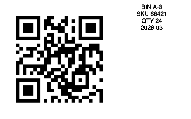
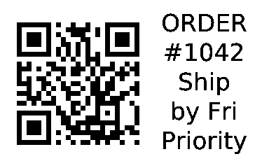

# thermark

**Print labels without the vendor app.** Local, scriptable QR codes, Wi-Fi
stickers, inventory tags, and text for pocket thermal printers. No cloud or
account needed to print.

[Download for macOS or Linux](https://github.com/kahwee/thermark/releases/latest) ·
[View the offline demo](https://kahwee.github.io/thermark/) ·
[Report your printer](https://github.com/kahwee/thermark/issues/new?template=hardware-report.yml)

**Hardware-tested: B1 over Bluetooth LE.** USB and other printer profiles are
experimental. thermark prints monochrome labels; it does not support colour
printing.

## Install and print your first label

On macOS (Apple Silicon or Intel), install the prebuilt BLE binary:

```sh
brew install kahwee/thermark/thermark
```

For Linux, or macOS without Homebrew, use the
[prebuilt downloads](https://github.com/kahwee/thermark/releases/latest).
Choose `ble` for Bluetooth or `full` for experimental USB serial support.
No Rust compiler is needed for a prebuilt download.

With Rust 1.99 or newer, install from crates.io:

```sh
cargo install thermark --locked
```

See the [installation guide](docs/installation.md) for Linux prerequisites,
archive installation, upgrades, and troubleshooting.

Turn on your B1, load 50×30 mm labels, and quit the vendor app. Then:

```sh
thermark scan --save
thermark doctor --use-config
thermark qr --url "https://example.com" --text "Hello, label!" --label 50x30
```

If several printers appear, follow the scan selection hint. On macOS, allow
Bluetooth access for your terminal when requested. See
[connection troubleshooting](docs/usage.md#macos-bluetooth-ownership) if discovery fails.

### Try it without a printer

```sh
thermark qr --url "https://example.com" --text "Hello, label!" \
  --model b1 --label 50x30 --save hello-label.png --no-print
```

This saves a real PNG locally without connecting to hardware. Scan its QR or
inspect the layout before spending a label.

| Guest Wi-Fi | Inventory | URL + text |
| --- | --- | --- |
|  |  |  |

These are rendered previews using public demo data, not photographs of prints.

Explore [eight copy-and-paste label recipes](docs/recipes.md): Wi-Fi, inventory,
manuals, return instructions, badges, storage, packing, and batch labels.
Render the whole gallery with `sh examples/render-recipes.sh` from a source checkout.

## Support

| Model family / path | Status |
|---|---|
| B1 over BLE | Hardware-tested |
| B1 over USB serial | Experimental; implemented and mock-tested |
| B1 Pro, B21 Pro, D11, D11_H, D110 | Experimental monochrome profiles |
| B18 | Geometry known; print task unresolved |

Printing with any profile/task/connection combination other than B1+B1 over
BLE requires `--allow-experimental`; offline previews and saved renders do not.
Multi-colour printheads and colour raster protocols are out of scope.

## Documentation

- [Installation, upgrades, and prerequisites](docs/installation.md)
- [Printing, previews, calibration, and troubleshooting](docs/usage.md)
- [Builds, tests, benchmarks, and security checks](docs/development.md)
- [Release checklist and distribution updates](docs/releasing.md)
- [Contributing and hardware reports](CONTRIBUTING.md)
- [Hardware notes](docs/hardware-notes.md)
- [Library API](https://docs.rs/thermark) and [release history](CHANGELOG.md)
- [Agent guidance](AGENTS.md)

## License

MIT

## CI maintenance

[GitHub Actions maintenance](.github/ACTIONS.md) covers workflows, parallel checks, action versions, and weekly updates.
