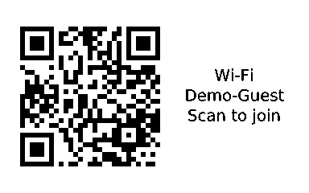
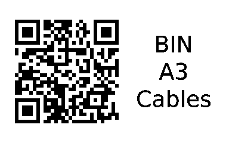
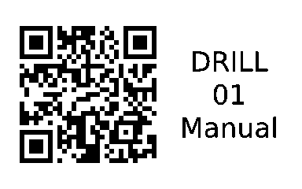
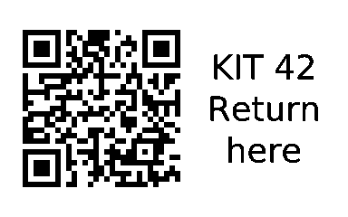
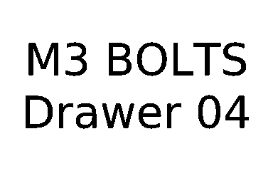
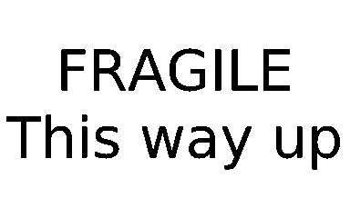
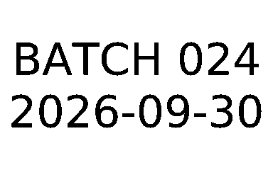

# Label recipes

Eight useful labels you can render before buying or connecting a printer.
Install thermark using the [installation guide](installation.md). Commands below
work in a POSIX shell on macOS or Linux and use fictional, public demo data.

All previews use the B1 profile and 50×30 mm media. They are rendered PNGs,
not hardware photographs. Use your actual label size when printing.

```sh
mkdir -p local/prints
```

Choose a recipe, inspect the PNG, and scan QR previews with your phone.
For a physical print, first follow the [connection guide](../README.md#install-and-print-your-first-label),
then remove `--no-print`. B1 over BLE is the hardware-tested path.
Wi-Fi QR codes contain the password even when it is not printed as text; keep
real credentials and saved labels under ignored `local/`.

To reproduce the gallery from a source checkout:

```sh
sh examples/render-recipes.sh local/prints/recipes
```

This renders all eight previews without connecting to hardware. It requires an
installed `thermark`; set `THERMARK_BIN` to use a locally built binary.
Use `THERMARK_FONT` to select a `.ttf` or `.ttc` font. Appearance varies by font.

## Guest Wi-Fi

Let visitors scan a network label. These credentials are fictional.



```sh
thermark wifi --ssid "Demo-Guest" --password "demo-only-1234" \
  --model b1 --label 50x30 --save local/prints/guest-wifi.png --no-print
```

## Inventory bins

Link a storage bin to its contents.



```sh
thermark qr --url "https://example.com/bins/A3" --text "BIN A3\nCables" \
  --model b1 --label 50x30 --save local/prints/inventory.png --no-print
```

## Equipment manuals

Put the instructions beside the tool.



```sh
thermark qr --url "https://example.com/manuals/drill" --text "DRILL 01\nManual" \
  --model b1 --label 50x30 --save local/prints/equipment.png --no-print
```

## Return instructions

Give a shared kit a return page without exposing personal contact details.



```sh
thermark qr --url "https://example.com/return/42" --text "KIT 42\nReturn here" \
  --model b1 --label 50x30 --save local/prints/return.png --no-print
```

## Name badges

Make a simple badge for a meetup or workshop.


```sh
thermark text --text "ALEX\nVolunteer" \
  --model b1 --label 50x30 --save local/prints/badge.png --no-print
```

## Storage labels

Mark small parts drawers with readable text.



```sh
thermark text --text "M3 BOLTS\nDrawer 04" \
  --model b1 --label 50x30 --save local/prints/storage.png --no-print
```

## Packing labels

Add a handling reminder to a parcel.



```sh
thermark text --text "FRAGILE\nThis way up" \
  --model b1 --label 50x30 --save local/prints/packing.png --no-print
```

## Batch identification

Identify a batch with an explicit date. Replace both values for your workflow.



```sh
thermark text --text "BATCH 024\n2026-09-30" \
  --model b1 --label 50x30 --save local/prints/batch.png --no-print
```
